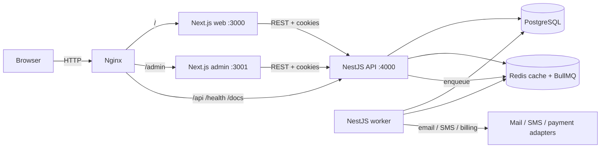
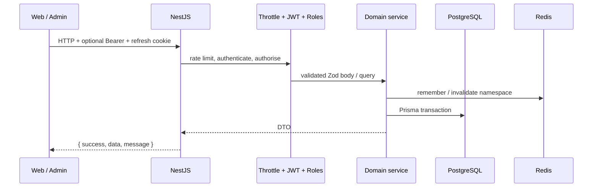

# Architecture

The platform is a pnpm + Turborepo monorepo with three deployable apps and a shared contract layer.

## Why this split

- **Web** is the public site and the customer portal. City selection, coverage, applications, invoices, tickets, and CMS pages all call the API.
- **Admin** is a separate Next.js app so staff UI, RBAC, and the public marketing surface can ship independently. In Docker it is mounted at `/admin`.
- **API** is the only process that writes business data. Money, coverage, and application state machines live here, not in the browser.
- **Worker** shares the API codebase (`apps/api/src/worker.ts`) and drains BullMQ. When Redis is disabled, the API runs the same handlers inline so local development still generates invoices.

## Shared contracts

| Package | Responsibility |
| --- | --- |
| `@stormfiber/types` | DTOs, enums, permission keys |
| `@stormfiber/validation` | Zod schemas used by Nest pipes and (where needed) the clients |
| `@stormfiber/config` | Canonical route table (`publicRoutes`, `dashboardRoutes`, `adminRoutes`, `apiRoutes`) |
| `@stormfiber/ui` | Marketing design-system primitives |

Nothing in the apps should hard-code a path string that already exists in `@stormfiber/config`.

## Request path

Guards are ordered on purpose: throttle, then JWT, then roles/permissions. Unauthenticated floods never reach token verification.

## Domain modules (API)

| Module | Owns |
| --- | --- |
| Auth | Register, login, OTP, refresh rotation, password reset |
| Geography | Cities, areas, sub-areas |
| Coverage | Zone resolution, checks, leads, import/export |
| Catalog | Products, plans, add-ons, promotions, city prices, tax rules, quotes |
| Applications | Connection applications and the status state machine |
| Customers | Portal profile and account linkage |
| Subscriptions | Active service, change requests, admin review |
| Billing | Invoices, tax, PDF, cron-driven cycles |
| Payments | Provider registry, webhooks, refunds |
| Support | FAQs, tickets, messages |
| Callbacks | Public callback capture and staff assignment |
| CMS | Hero slides, pages, sections, site settings |
| Analytics | Public ingest (IP prefix only) and admin dashboards |
| Admin | Staff CRUD, roles, permissions, operational list endpoints |
| Notifications | Email / SMS / in-app fan-out |
| Storage | Local or S3 uploads |

## Caching

Redis namespaces are invalidated on admin writes:

- `catalog:`
- `cms:`
- `support:`
- `coverage:`
- geography city lists (`CacheKeys.cities`)

Public reads may be stale for at most the configured TTL. Writes always hit PostgreSQL first.

## Frontends

Both Next.js apps use the App Router, Tailwind, and a thin `apiGet` / `apiSend` client that unwraps the API envelope. They store the access token in memory (and session persistence helpers) and rely on the HTTP-only refresh cookie for renewal.

Coverage checks, price quotes, and application submits fail visibly when the API is unreachable. Static fallbacks exist only for marketing copy and city lists used to render selectors — never for a successful serviceability or payment result.

## Background work

`BillingScheduler` enqueues, in Asia/Karachi time:

- 01:00 invoice generation
- 02:00 overdue marking
- 09:00 reminders

The worker process is required in production. Locally, inline handlers cover the same jobs if Redis is off.
