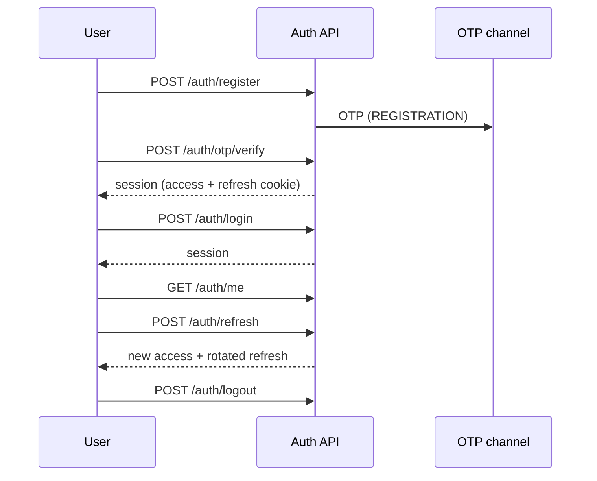

# Authentication

Authentication is cookie + bearer, not session pages rendered by the API.

## Tokens

| Token | Transport | Lifetime (defaults) |
| --- | --- | --- |
| Access JWT | `Authorization: Bearer` | `JWT_ACCESS_TTL` = 900 seconds |
| Refresh JWT | HTTP-only cookie `sf_refresh` (or JSON body for non-browser clients) | `JWT_REFRESH_TTL` = 30 days |

Refresh tokens are stored hashed in `RefreshToken` and rotate on every successful `/auth/refresh`. Reuse of a consumed refresh token is treated as theft: the family is revoked.

Passwords are hashed with bcrypt (`BCRYPT_ROUNDS`, default 12). Login tracks `failedLoginCount` / `lockedUntil`.

## Flows

OTP purposes: `REGISTRATION`, `LOGIN`, `APPLICATION`, `PASSWORD_RESET`, `MOBILE_VERIFICATION`.

Limits (env): `OTP_TTL_SECONDS`, `OTP_MAX_ATTEMPTS`, `OTP_RESEND_COOLDOWN_SECONDS`. Request endpoints are also throttled more tightly than the global limiter.

OTP codes are emailed only. They are stored as HMAC hashes, never returned in API responses, and never written to notification logs. `OTP_DEV_ECHO` must stay `false`.

Password reset: `POST /auth/forgot-password` always looks successful to the client; a one-time token is emailed. `POST /auth/reset-password` consumes it.

## Guards

1. `ThrottlerGuard` — `THROTTLE_TTL` / `THROTTLE_LIMIT`
2. `JwtAuthGuard` — `@Public()` opts out
3. `RolesGuard` — `@Roles()` is OR, `@RequirePermissions()` is AND

`SUPER_ADMIN` is treated as holding every permission in the admin users service. Staff routes use `STAFF_ROLES` (every role except `CUSTOMER`). The admin console additionally rejects customer accounts in the browser (`assertStaff`).

## Cookies

| Variable | Meaning |
| --- | --- |
| `COOKIE_DOMAIN` | Host the refresh cookie is scoped to |
| `COOKIE_SECURE` | `true` in production compose; requires HTTPS |

CORS allows credentials from `CORS_ORIGINS`. The Next apps must be listed there or the refresh cookie will not be sent.

## RBAC

Roles are stored in PostgreSQL and assigned through `/admin/users` and `/admin/roles`. Permission keys are defined in `packages/types/src/permissions.ts` and seeded in `prisma/seed/steps/rbac.ts`.

The last remaining active super-admin cannot be disabled, so the operator cannot lock themselves out of the console.
