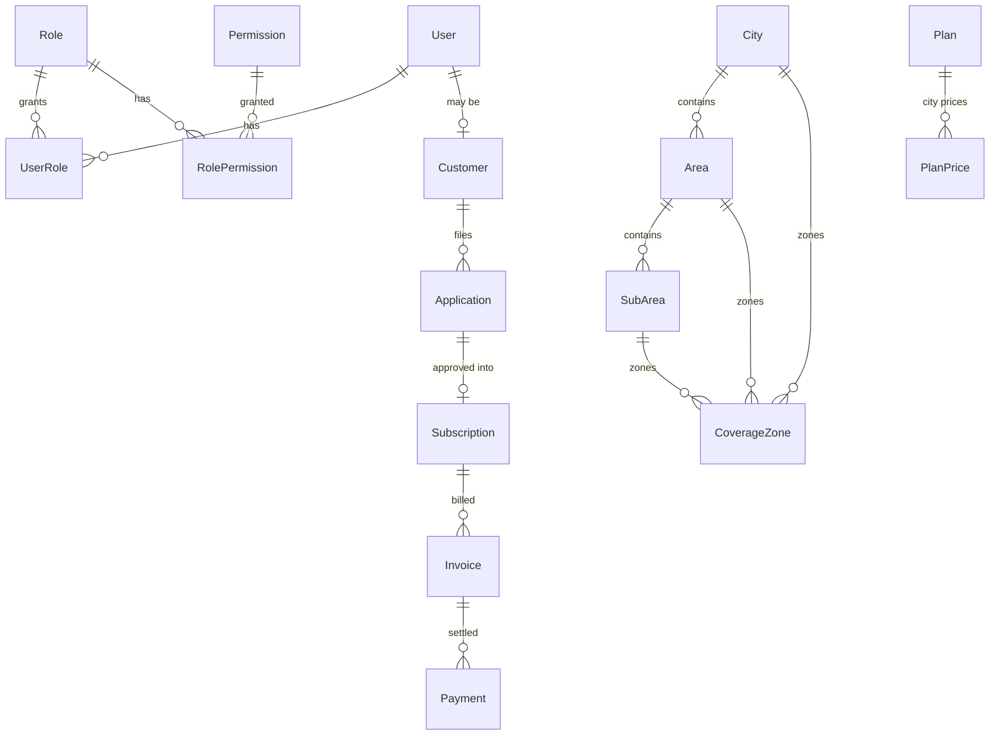

# Database

PostgreSQL is the system of record. The Prisma schema lives at `apps/api/prisma/schema.prisma`.

## Conventions

- UUID primary keys generated by the database
- `snake_case` tables and columns via `@map` / `@@map`; camelCase in application code
- Money is `Decimal(12, 2)` only. It is never a float and is never computed in the browser
- `createdAt` / `updatedAt` on every mutable table
- Soft delete (`deletedAt`) on catalog and content tables so historical invoices keep their references
- Indexes on every foreign key used for filtering, and on the coverage lookup path

## Entity groups



### Identity

`User`, `Role`, `Permission`, `UserRole`, `RolePermission`, `RefreshToken`, `PasswordResetToken`, `OtpRequest`.

Staff never receive the `CUSTOMER` role through the admin users API. The last active `SUPER_ADMIN` cannot be disabled.

### Geography and coverage

`City` → `Area` → `SubArea`. Coverage *display* status can live on area/sub-area rows. The authoritative decision is `CoverageZone`, resolved **sub-area → area → city**. Every public check writes `CoverageCheck`; unavailable / coming-soon paths can create `CoverageLead`.

### Catalog and pricing

`Product`, `Plan`, `PlanFeature`, `PlanAddon`, `PlanPrice`, `Promotion`, `TaxRule`, `CityTaxRule`. Quotes and invoices use server-side tax and city overrides.

### Customers and fulfilment

`Customer`, `CustomerAddress`, `Application`, `ApplicationStatusHistory`, `Subscription`, `SubscriptionItem`, `SubscriptionHistory`, `SubscriptionChangeRequest`.

Applications must target a serviceable location; the applications service re-checks coverage rather than trusting the client.

### Billing

`Invoice`, `InvoiceItem`, `Payment`, `PaymentTransaction`, `PaymentWebhook`, `Refund`. Invoice numbers come from `SequenceService`.

### Support and content

`Faq`, `FaqCategory`, `Ticket`, `TicketMessage`, `CallbackRequest`, `HeroSlide`, `CmsPage`, `CmsSection`, `SystemSetting`, `Notification`, `MediaAsset`.

### Observability

`AnalyticsEvent` (hashed / prefixed IP), `AuditLog`, `IdempotencyRecord`.

## Migrations and seed

```bash
pnpm db:generate    # prisma generate
pnpm db:migrate     # prisma migrate dev
pnpm db:deploy      # prisma migrate deploy (CI / production)
pnpm db:seed        # cities, catalog, CMS, RBAC, demo users
pnpm db:validate
```

Seed steps are split under `apps/api/prisma/seed/steps/`: `rbac`, `geography`, `catalog`, `content`, `support`, `demo`.

Production compose runs `prisma migrate deploy` before the API process starts. Seed is never applied automatically in production.
