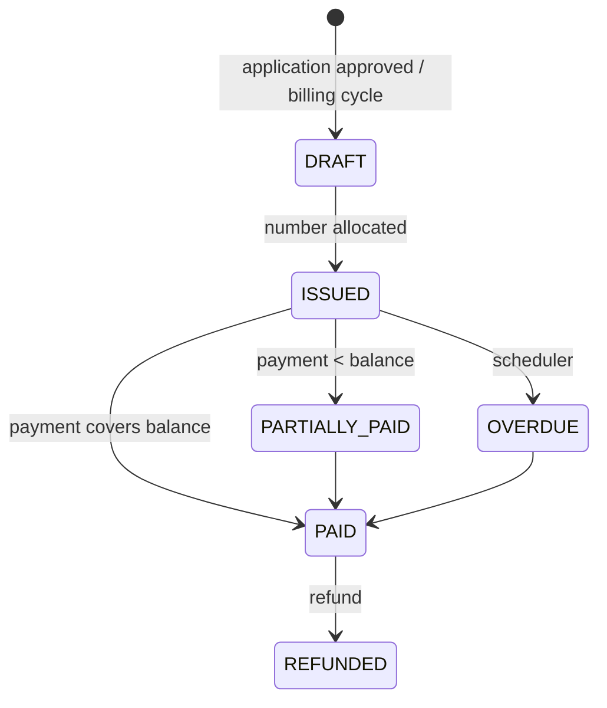
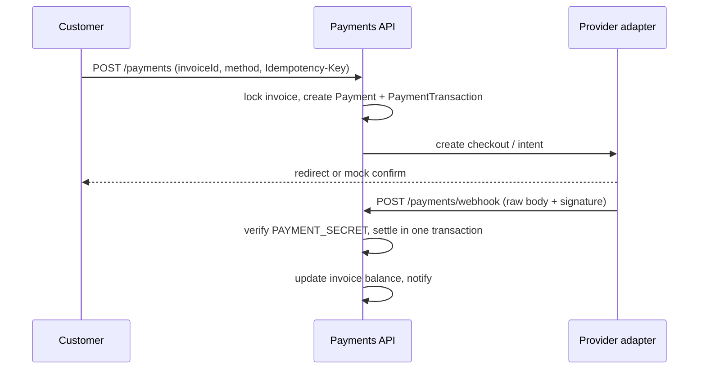

# Payments and billing

Money never leaves the API as a float. Prisma `Decimal(12, 2)` plus `apps/api/src/common/utils/money.ts` are the only arithmetic path.

## Invoice lifecycle

`SequenceService` issues human invoice numbers. Line items capture plan, add-ons, installation, and tax snapshots so later catalogue edits do not rewrite history.

Daily jobs (Asia/Karachi), enqueued by `BillingScheduler` and run by the worker:

| Time | Job |
| --- | --- |
| 01:00 | Generate invoices for due subscriptions |
| 02:00 | Mark overdue |
| 09:00 | Send reminders |

When Redis is unavailable in development, the same handlers run inline inside the API process.

Customers download PDFs from `GET /customer/invoices/:id/pdf`.

## Payment methods

`PaymentProviderRegistry` routes:

- **Online** (card / wallet): configured by `PAYMENT_PROVIDER` (`mock` in development)
- **Offline** (bank transfer / cash): recorded by staff or the customer as pending until confirmed

`PAYMENT_CURRENCY` defaults to `PKR`. `PAYMENT_RETURN_URL` is where the browser lands after a hosted checkout (`/dashboard/payments/return` on the public site).

## Create → settle

Webhook verification uses the **raw** request bytes stored by the JSON parser (`rawBody`). Re-serializing the parsed object would break signatures.

Replayed webhooks are stored on `PaymentWebhook` and are no-ops if the payment is already terminal.

The mock provider exposes a sandbox confirm path used only when `PAYMENT_PROVIDER=mock`. Production adapters must implement `verifySignature` and the same settle function.

## Refunds

Staff with `payments.refund` create `Refund` rows. The invoice is adjusted in the same transaction. The requesting user is recorded for the audit log.

## Tax

`TaxRule` and `CityTaxRule` are applied on the server during quote and invoice generation. Clients may display a quote; they must not recompute tax.
